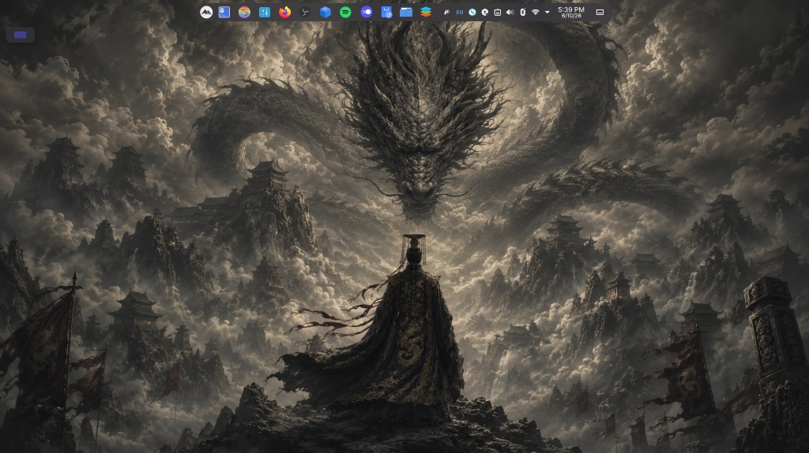

# DragonTheme Installer 🐉

A one-click graphical desktop beautifier for **Kubuntu / KDE Plasma 5**.

This tool instantly transforms a default KDE Plasma installation into a stunning, cinematic, and fully customized desktop environment. It automatically installs and applies:
- **Global Themes & Window Decorations** (Dark glass effects)
- **Tela Icon Theme** (Circular, modern icons)
- **Layan Cursors** (Smooth, elegant pointers)
- **High-Quality Desktop Wallpaper**
- **Desktop Effects** (Blur, transparency, rounded corners)



## Requirements
- **OS:** Ubuntu, Debian, Arch, or any Linux distribution running **KDE Plasma 5**.
- *(Note: Standard Ubuntu users using GNOME must install `kde-plasma-desktop` first).*

## How to use
1. Go to the [Releases](../../releases) page and download the latest `DragonTheme_Installer` binary.
2. Make the file executable:
   ```bash
   chmod +x DragonTheme_Installer
   ```
3. Run the installer:
   ```bash
   ./DragonTheme_Installer
   ```
4. Toggle the features you want and click **Install**. Your desktop will restart automatically with the new look!

## Building from source
If you want to compile the application yourself:

1. Clone this repository:
   ```bash
   git clone https://github.com/yourusername/DragonTheme-Installer.git
   cd DragonTheme-Installer
   ```
2. Install dependencies:
   ```bash
   python3 -m venv venv
   source venv/bin/activate
   pip install customtkinter pillow pyinstaller
   ```
3. Build the executable:
   ```bash
   pyinstaller --noconfirm --windowed --onefile --name "DragonTheme_Installer" --add-data "theme.tar.gz:." --add-data "preview.jpg:." --hidden-import PIL._tkinter_finder app_main.py
   ```
4. The compiled app will be in the `dist/` directory.

## License
MIT License. See [LICENSE](LICENSE) for more details.
